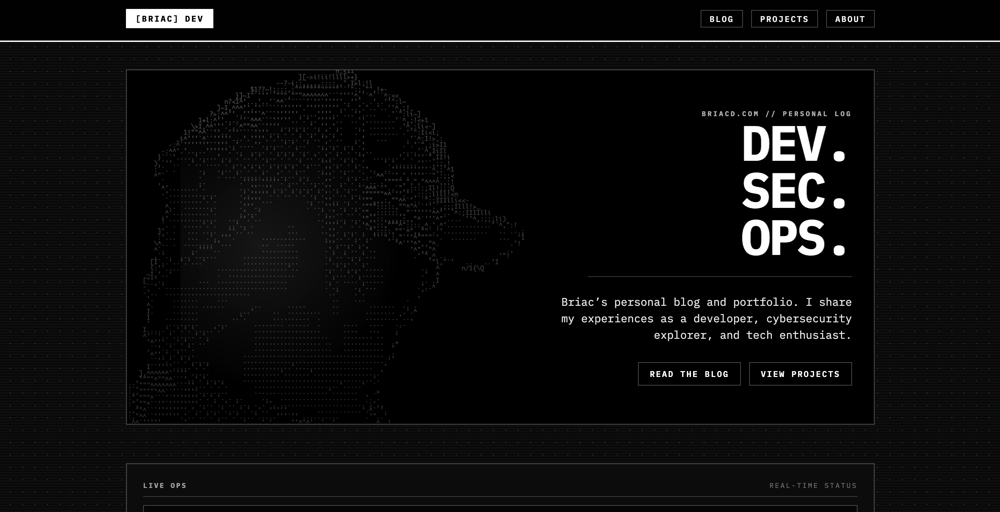

# Terminal Portfolio



A minimalist black-and-white portfolio and blog built with **Nuxt 4**, **TypeScript**, and **Nuxt Content**.

This project is designed for developers and security-focused creators who want:
- file-based content editing (Markdown)
- strong typography and terminal/brutalist UI
- static-friendly performance
- built-in SEO essentials (RSS, sitemap, robots)

## Demo

Live demo: [https://briacd.com](https://briacd.com)

Run locally:

```bash
npm install
npm run dev
```

Then open: `http://localhost:3000`


## Features

- Nuxt 4 + TypeScript strict mode
- Nuxt Content collections for:
  - blog articles
  - projects
  - roadmaps (SEO track)
- Dark monochrome terminal-inspired UI
- Responsive layout for mobile and desktop
- Search + tag filters on blog/projects/roadmaps pages
- Markdown article pages with TOC and prev/next navigation
- Project pages with links and markdown content
- SEO roadmap section under `/seo/*`
- RSS feed: `/rss.xml`
- Sitemap: `/sitemap.xml`
- Robots file: `/robots.txt`
- GitHub stats block on home page

## Tech Stack

- [Nuxt](https://nuxt.com/)
- [Nuxt Content](https://content.nuxt.com/)
- [Nuxt UI](https://ui.nuxt.com/)
- [Tailwind CSS](https://tailwindcss.com/)

## Quick Start

Install dependencies:

```bash
npm install
```

Start development:

```bash
npm run dev
```

Build for production:

```bash
npm run build
```

Preview production build:

```bash
npm run preview
```

Type check:

```bash
npm run typecheck
```

## Environment Variables

Create your local env file from the example:

```bash
cp .env.example .env
```

Supported variables:

- `GITHUB_TOKEN` (optional)
  - used by `/api/github-stats` for richer GitHub metrics
- `FOOTER_GITHUB_URL` (optional)
- `FOOTER_LINKEDIN_URL` (optional)
- `FOOTER_EMAIL` (optional)
- `UMAMI_WEBSITE_ID` (optional)
  - enables Umami analytics script injection (`https://cloud.umami.is/script.js`)

If footer variables are empty, their buttons are hidden automatically.


## Open Source Guidelines

### Contributing

Contributions are welcome.

1. Open an issue first for significant changes.
2. Fork the repository.
3. Create a feature branch.
4. Run checks before pushing:
   - `npm run typecheck`
   - `npm run build`
5. Open a pull request with:
   - clear summary
   - screenshots if UI changed
   - related issue reference

### Code Style

- Keep TypeScript strict-compatible
- Prefer composables for reusable query logic
- Keep UI monochrome and accessible
- Avoid unnecessary dependencies

## License

MIT.
